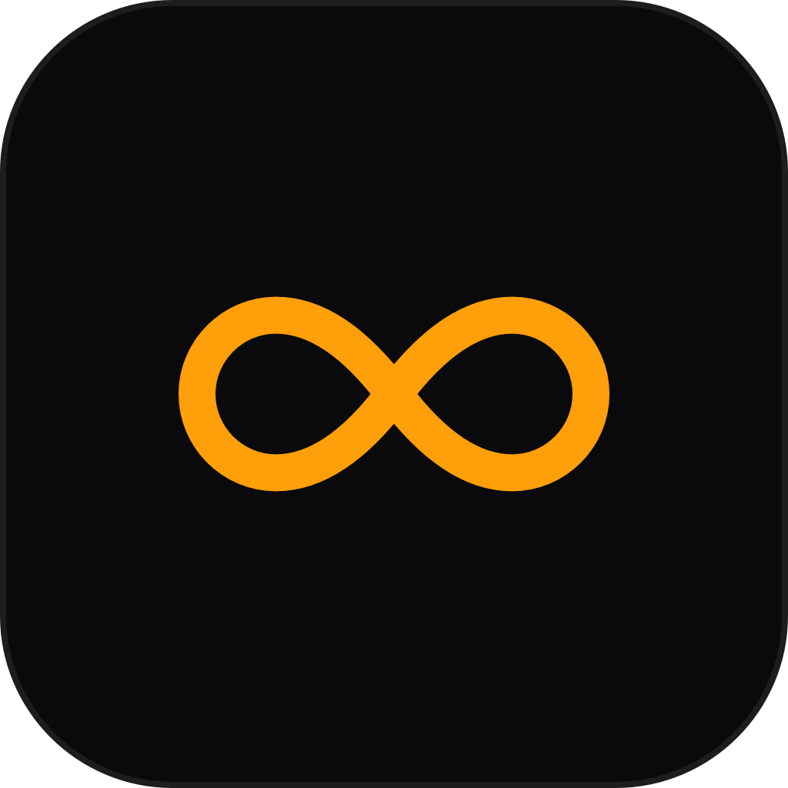

<p align="center">
  
  <br />
  <h1 align="center">7elewen</h1>
  <p align="center">Stay awake. 24/7.</p>
  <p align="center">
    <a href="https://7elewen.vercel.app"></a>
    <a href="https://github.com/arinltte/7elewen/releases/latest"></a>
    <a href="https://github.com/arinltte/7elewen/blob/main/LICENSE"></a>
    
    
  </p>
</p>

---

**7elewen** is a lightweight macOS menu-bar utility that keeps your MacBook awake when you close the lid — so your downloads, builds, servers, and long-running tasks are never interrupted by sleep. Built natively with SwiftUI and Liquid Glass, it also dims and brightens your display automatically as the lid opens and closes, and can flip on Low Power Mode to save battery while the lid is shut.

---

## 🏗️ Features

- **Menu bar native** — Lives quietly in your menu bar as an ∞ symbol. No Dock icon, no persistent window, no interruption to your workflow.
- **Lid-close sleep override** — Close your MacBook lid without it going to sleep. Your Mac keeps running **24/7**.
- **Lid-angle sensing** — Reads the built-in lid angle sensor in real time to **auto-dim** the display as the lid closes and **auto-brighten** it as it opens.
- **Low Power Mode** — Optionally enable Low Power Mode automatically while the lid is closed to save battery, then restore it when you open back up.
- **Liquid Glass design** — A native macOS 26 (Tahoe) liquid glass panel with a subtle animated orange glow around the control when active.
- **In-app updates** — Check for the latest release straight from the About screen; one click takes you to the GitHub release page.
- **Fine-grained control** — Tune exactly when to dim and brighten (in degrees) and how far to dim, all from the settings pane.

---

## Requirements

- macOS 26 (Tahoe) or later.
- A one-time administrator password to set up passwordless sleep control.

---

## 🚀 Installation

### Recommended

Download the latest `.dmg` from the [Releases](https://github.com/arinltte/7elewen/releases/latest) page, open it, and drag **7elewen** to your Applications folder.

### Gatekeeper

If macOS blocks the app on first launch, run the following in Terminal:

```bash
xattr -rd com.apple.quarantine /Applications/7elewen.app
```

### One-time setup

On first activation, **7elewen** asks for your administrator password **once** to install a passwordless `pmset` rule at `/etc/sudoers.d/7elewen`. This is what lets the app disable sleep and toggle Low Power Mode without prompting you every time.

---

## Getting Started

1. Click the **∞** icon in your menu bar.
2. Press **Activate**.
3. Close your MacBook lid — it stays awake while the display dims automatically.
4. (Optional) Open **Settings** (the gear icon) to tune the thresholds and Low Power Mode.
5. Click anywhere outside the panel — or press the **∞** icon again — to dismiss it.

---

## ⚙️ Settings

| Setting | Range | Description |
| --- | --- | --- |
| Dim when lid closes | 0° – 30° | Lid angle at/below which the display dims. |
| Brighten when lid opens | 1° – 30° | Lid angle at/above which the display brightens. |
| Dim brightness to | 0% – 50% | Brightness level the display dims to. |
| Low Power Mode when closed | on / off | Enables Low Power Mode while the lid is shut. |

---

## 📂 Data & Privacy

**7elewen** stores the following locally and transmits **nothing** — no telemetry, no analytics, no background network calls (the only network request is the update check, which you trigger manually).

| Location | Contents |
| --- | --- |
| `/etc/sudoers.d/7elewen` | Passwordless rule for `pmset disablesleep` / `lowpowermode` |
| `~/Library/Preferences/arinltte.-elewen.plist` | App preferences (dim/brighten angles, brightness, Low Power Mode) |

To perform a complete uninstall and remove all application data:

```bash
sudo rm -f /etc/sudoers.d/7elewen
rm -f ~/Library/Preferences/arinltte.-elewen.plist
killall cfprefsd
```

---

## 🌐 Website

Visit the landing page at **[7elewen.vercel.app](https://7elewen.vercel.app)** for screenshots, downloads, and more.

---

## 🤝 Contributing

Contributions are welcome. Whether it's a bug report, a feature suggestion, a documentation improvement, or a pull request — all are appreciated.

**To contribute:**

1. Fork the repository.
2. Create a feature branch: `git checkout -b feature/your-feature-name`
3. Commit your changes with a clear message.
4. Open a pull request against `main` with a description of what you changed and why.

**To report a bug or request a feature**, open an [issue](https://github.com/arinltte/7elewen/issues). Please include your macOS version and steps to reproduce for bug reports.

---

## Building from Source

```bash
git clone https://github.com/arinltte/7elewen.git
cd 7elewen
open 7elewen.xcodeproj
```

Build and run the `7elewen` scheme in Xcode. Requires Xcode 26 or later (for the macOS 26 SDK).

---

## 📜 License

Distributed under the MIT License. See `LICENSE` for more information.

<p align="center">
  <i>Developed by arinltte · arinltte00@gmail.com</i>
</p>